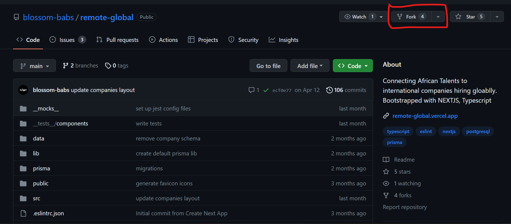
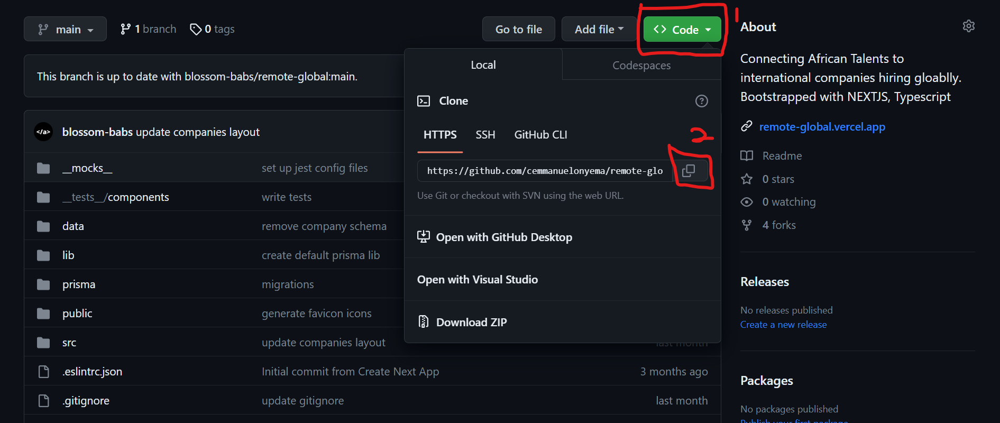

# Contribution Guidelines 🙌

This documentation contains a set of guidelines to help you during the contribution process of this project. I'm happy to welcome all the contributions from anyone willing to add new scripts to this repository. Thank you for helping out and remember, No contribution is too small.

## Steps To Follow Before You Contribute 🛠️

Please make sure you follow this guidelines so your code can be merged as quickly as possible

1. On the [GitHub page for this repository,]('https://github.com/blossom-babs/remote-global') click on the Button "Fork".



2. Clone your forked project to your local computer



- for example, run this command inside your terminal:

```bash
git clone https://github.com/<your-github-username>/remote-global.git
```

3. Shift into project folder

```bash
cd path to project folder
```

4. Before you make any changes, keep your fork in sync to avoid merge conflicts:

```bash
git remote add upstream https://github.com/blossom-babs/remote-global.git
git pull upstream main
```

5. After adding the upstream and checking that all files are up to date, create new branch before fixing or editing any files.

```bash
  git checkout -b <branch-name>
```

6. Done fixing any issue ? Add the changes with git add, git commit (write a good commit message, if possible):

```bash
git add file or files
git commit -m "descriptive message"
```

7. Push your changes to your repository and make a pull request:

```bash
git push origin <branch-name>
```

## Styles Guidelines 🎨

1. Every page and component should have a corresponding and independent stylesheet in the _`styles`_ folder

2. Files in the component folder should have a corresponding test script writing with jest testing library

3. Files in the pages folder should have a corresponding test script writing with cypress e2e testing
